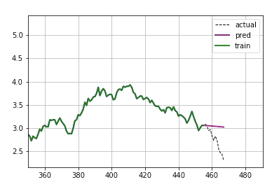
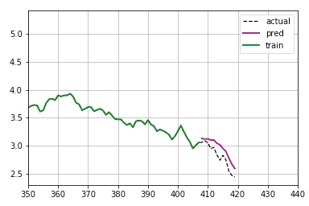
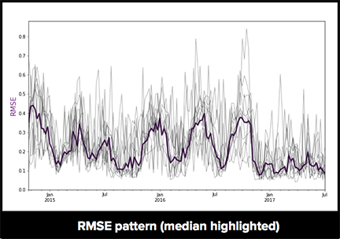
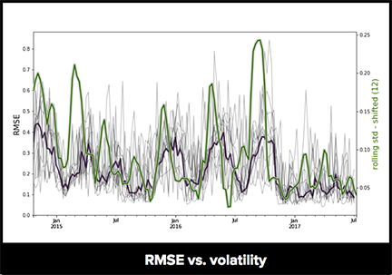
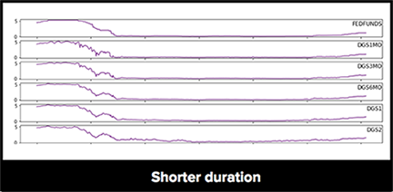
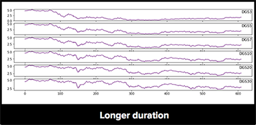
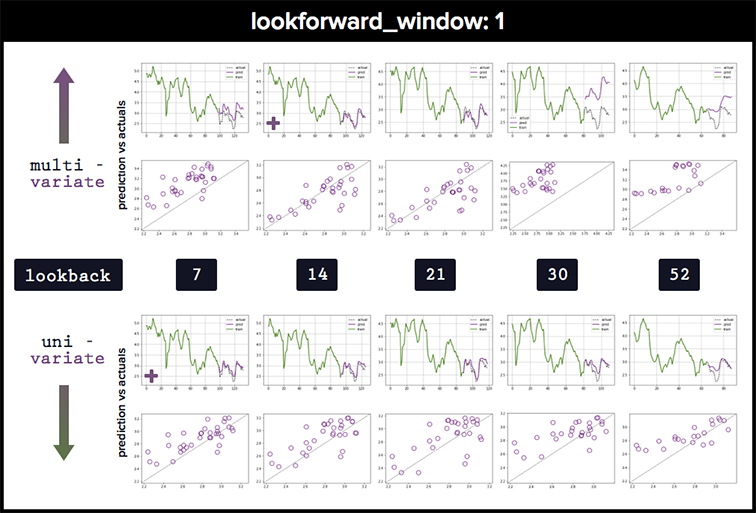

-----------------

## Time Series | Interest rate forecasting

-----------------
### Summary

This repo contains a series of Jupyter notebooks comparing several approaches to doing timeseries forecasting.  The underlying dataset used pertains to US Treasury yield curve rates (continuous maturity), although is not altogether that relevant to the task.  Specifically, it explores <a href="https://en.wikipedia.org/wiki/Autoregressive_model" target="_blank">autoregressive (AR)</a>, <a href="https://en.wikipedia.org/wiki/Autoregressive_integrated_moving_average" target="_blank">autoregressive integrated moving average (ARIMA)</a>, <a href="https://en.wikipedia.org/wiki/Recurrent_neural_network" target="_blank">recurrent neural nets (RNN/LSTM)</a>, and classical machine learning <a href="https://en.wikipedia.org/wiki/Random_forest" target="_blank">(random forest)</a> models.

Not surprisingly, recurrent neural nets deliver the most promising results.  To illustrate, the animations below compares rolling 12 period forecasts for ARIMA (left) and RNN (right), which arguably overfits.

  

### Data
Elected to use financial timeseries (interest rates) for the underlying dataset, knowing that they are characterized by a high degree of stochasticity - which is helpful for exposing shortcomings of the various modeling approaches.  Not to weigh in much on efficient market theory, but it's unclear how impactful this sort of approach is in actually predicting future rate levels.  Much smarter people than myself have spent enormous time and energy pursuing this task with limited success.

### Model assessments (summary)
Recurrent neural networks achieve the best results, and are able to tease out more nuance and structure from the training data, although are pretty easy to overfit given the relatively low dimension nature of this data (used a single layer and 0.20 dropout to help accommodate).  Compared to alternative modeling options, the predictions made by LSTM networks are much better at picking up directional trends and variation in the data. Using **multivariate approaches** (including different parts of the curve when training) is also generally able to **outperform** univariate approaches, when calibrated correctly.  The multivariate approaches require more training epochs and wider hidden layers to achieve better results, and admittedly have outcomes that are more sensitive to parameter calibration (and greater relative benefit from weight regularization).

Autocorrelation for this data degrades over longer time horizons; as such, all of the techniques tend to perform better with shorter prediction windows.  Uniformly, the models deliver lower errors during periods of more contained volatility, regardless of how large of training windows are used. To illustrate this, the first image below compares modeling errors generated when predicting the continuous 30-year rate over 12-period windows (measured by <a href="https://en.wikipedia.org/wiki/Root-mean-square_deviation" target="_blank">root-mean-square error (RMSE)</a>) for various calibrations of LSTM networks, with the median highlighted.  The second image shows how those errors correlate with rolling volatility (shifted back by the size of the prediction window), highlighted in green.

  
  

### Repo structure
* (1) *data pull*: code for pulling new data from Federal Reserve API
* (2) *visual assessment*: using a <a target="_blank" href="https://en.wikipedia.org/wiki/Box%E2%80%93Jenkins_method">Box Jenkins</a>-style approach, a quick visual assessment of the data 
* (3) *autoregessive model*: running through simple autoregressive example; addressing stationarity
* (4) *ARIMA model*: a statsmodels implementation of an autoregressive integrated moving average model
* (5) *SARIMAX*: for comparison, exploring a statespace model addressing potential seasonality
* (6) *Prophet*: probably not that relevant for this dataset, but looking at <a target="_blank" href="https://research.fb.com/prophet-forecasting-at-scale/">Prophet</a>, a powerful open-source project out of Facebook 
* (7) *RNN (univariate)*: keras/tensorflow implementation of an LSTM network, using single variable lags
* (8) *RNN (multivariate)*: looking at a multivariate implementation of LSTM networks
* (9) *Supervised learner (random forest)*: not very effective in this context, but exploring the utility of a tree-based regressor (sklearn)

### Component models
**Overview**:
 
* `Autogressive (AR)`: 
Pretty limited predictive insight.  Given the stochastic nature of the data, the 'best' AR results achieved basically by straightlining forward recent observations. 
* `Autogressive integrated moving average (ARIMA)`: 
Incremental improvements over simple AR model, although also pretty uninformative, beyond confirming that recent results are a good starting point for predictions. 
* `Random forest`: Works well on certain parts of the test data, poorly on others; probably needs more robust data to deliver better regression results.  More preprocessing required to squeeze out performance. 
* `Recurrent neural net (LSTM)`: Most promising modeling choice, although easy to overfit.  Able to pick up on short-term patterns in trajectory changes and runs that occur in the historical observations. 
 

### Univariate vs. Multivariate approaches
For the longer-dated component segments of the yield curve, using a multivariate approach to the training data (i.e. including historical data across the curve) is generally able to deliver better results. Perversely, however, including the front-end of the curve (i.e. Federal Funds rate, 3-month, 6-month, 1-year, 2-year) very negatively impacts the predictive outcome of the networks.  The shorter-dated rates tend to be more of a controlled market, and were pegged close to zero (0.0%) for much of the training data used.  As such, including those does little to help estimating the future direction/velocity of longer-dated rate changes (certainly less so than during a more 'normal' rate environment).
  

  

Multivariate approaches also require more training epochs and wider hidden layers to calibrate properly, compared to univariate approaches, with outcomes that are more sensitive to changes in network parameters.  The below chart compares the prediction results using monthly data and single period prediction window for both the univariate and multivariate approaches.  From left-to-right, the size of the trailing training windows used increase in magnitude.  The multivariate set requires longer relative training windows to achieve comparable RMSE on test sets.  Although not included in the below comparison, including regularization penalty is pretty helpful in improving the results on multivariate training sets with longer windows.
  
 

**Other**:
The analyses only uses self-contained data (limited to histocial observations along the yield curve); as such, it would not be recommended to put anything like this into production without a more fulsome approach.

## Links:
There are a lot of different ways to skin this particular cat; here are a few interesting papers detailing alternative approaches:
* <a href="http://www.math.ku.dk/~rolf/HaganWest.pdf" target="_blank">Methods for Constructing a Yield Curve</a>
* <a href="https://arxiv.org/abs/1703.01536" target="_blank">A Statistical Machine Learning Approach to Yield Curve Forecasting</a>
 

